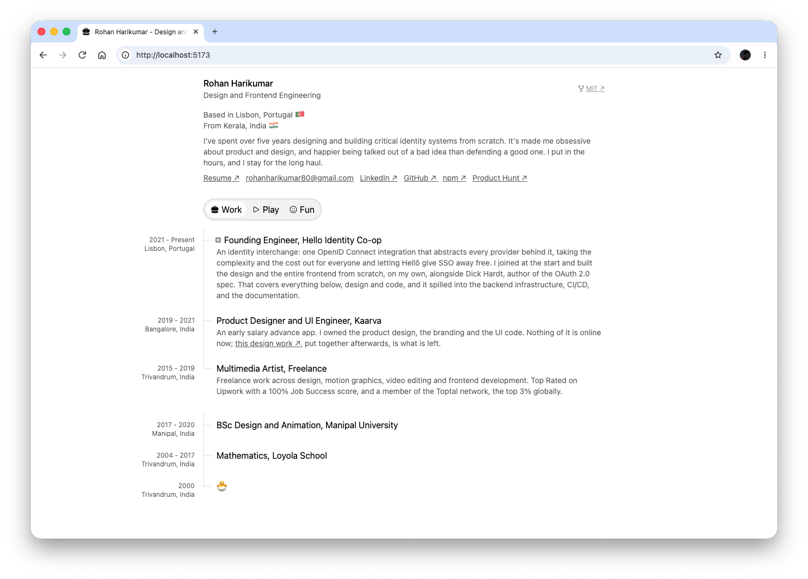

# rohanharikr.com

My portfolio. Live at **[rohanharikr.com](https://rohanharikr.com)**.

[](https://rohanharikr.com)

Three files, no framework. The whole site is one HTML page, one stylesheet and
one script — about 1,400 lines together, and most of that is content.

```
index.html     the content, and all of it
src/style.css  Tailwind, plus the handful of rules Tailwind can't express
src/main.js    vanilla, no dependencies
public/        images, favicons, the resume
```

## Running it

```bash
npm install
npm run dev      # vite, on :5173
npm run build    # to dist/
```

Pushing to `main` deploys to GitHub Pages.

## Adding things

**A new item** is a `<li>`. Nest an `<ol>` inside it and it becomes a
collapsible section — the script finds it, wraps the label in a toggle and
indents the guide line for you. Nothing to register anywhere.

**An image or embed** is an ``. Give it `link-1` and `link-1-title`
attributes and buttons to those links appear over it; add `link-2`, `link-3`
and so on for more.

**A new tab** is a `<button role="tab">` in the nav, a `<section
role="tabpanel">` with a matching `id`, and a `--bg-<id>` / `--line-<id>` pair
in `:root`. The reveal animation, the theming and the favicon all key off that
`id`.

## How it works

Everything is driven by the markup rather than configuration.

- **Tabs** cross-fade with a circle that opens from the tab you clicked, while
  a layer behind the page sweeps the incoming background colour across. The
  page stays interactive throughout — which is why this doesn't use the View
  Transitions API, where the browser suppresses hit testing for the duration.
- **Theming** is two custom properties, `--bg` and `--line`. Each tab sets a
  pair; everything else is mixed from them, so a new palette is two values.
- **The tree** draws its own guide lines from each item's nesting depth. Every
  heading sticks as you scroll past it, parents above children.
